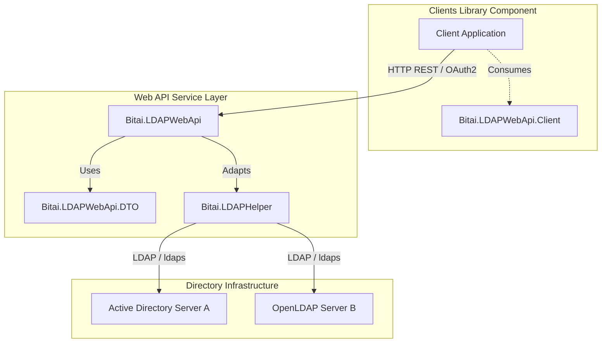

# Bitai LDAP Web API Ecosystem

[](https://dotnet.microsoft.com)
[]()
[]()

An enterprise-grade, cross-platform **ASP.NET Core Web API** and client ecosystem designed to centralize and simplify operations across one or more **LDAP and Microsoft Active Directory Servers**. 

The solution decouples direct network directory integrations by introducing a robust HTTP REST proxy layer. It supports secure authentication, highly optimized directory searching, and complete Active Directory user provisioning.

---

## 🏛️ Solution Architecture & Component Layout

The solution is divided into highly cohesive, decoupled components:



### 1. `Bitai.LDAPWebApi` (Service Host)
*   **Technology**: ASP.NET Core MVC (Targeting .NET 8.0)
*   **Role**: Host controller services exposing the directory proxy layer.
*   **Configuration**: Manages multi-tenant LDAP configurations under custom profiles via `appsettings.json`.
*   **Security**: Secured by OAuth2/Bearer authorization protocols (OAuth2 server, Identity Server, etc.).

### 2. `Bitai.LDAPWebApi.DTO` (Contracts)
*   **Role**: Defines the network models and transfer objects exchanged between clients and the Web API service (e.g., `LDAPServerProfile`, `LDAPServerCatalogTypes`).

### 3. `Bitai.LDAPWebApi.Client` (Client Wrapper)
*   **Role**: A strongly-typed C# library exposing client wrappers (`LDAPUserDirectoryWebApiClient`, `LDAPAuthenticationsWebApiClient`, `LDAPServerProfilesWebApiClient`, etc.) to integrate functionality into external client systems without writing HTTP handlers.

### 4. `Bitai.LDAPWebApi.Client.Demo` (Reference Program)
*   **Role**: Interactive demo application serving as a codebase reference for developer integrations.

---

## ✨ Features & Functionality

### 🔒 Enterprise Directory Authentication
Secure verification of directory credentials over traditional Domain accounts or raw Distinguished Names (DNs), returning structured authentication schemas including full membership roles.

### 🔍 Optimized Directory Searches
Perform complex search operations with multi-attribute filtering. Search payloads are fully optimized to retrieve only the required attributes (`Minimum`, `Few`, `All`), saving server bandwidth and client-side processing memory.

### 👤 Microsoft Active Directory Provisioning
Complete user state management over Active Directory:
*   Provisions new `LDAPMsADUserAccount` entries.
*   Performs secure password resets and updates (`unicodePwd` manipulation).
*   Enables/disables account states using native Active Directory `UserAccountControl` (UAC) bitwise flags.
*   Safely purges or removes user accounts.

### 🖥️ Multi-Server Profiles
Configure and balance queries across multiple independent directory infrastructures (e.g., local server profiles, global catalogs) concurrently using unique client context routes:
`/api/{serverProfile}/{catalogType}/[controller]`

---

## 🗺️ Web API Endpoint Catalog

The API exposes the following RESTful paths:

| Controller | HTTP Verb | Route | Description |
| :--- | :--- | :--- | :--- |
| **`Authentications`** | `POST` | `/api/{profile}/{catalog}/Authentications/authenticate` | Validates domain user credentials. |
| **`Directory`** | `GET` | `/api/{profile}/{catalog}/Directory/{identifier}` | Retrieves a general LDAP entry by unique ID. |
| | `GET` | `/api/{profile}/{catalog}/Directory/filterBy` | Search directory entries using attribute filters. |
| | `GET` | `/api/{profile}/{catalog}/Directory/Users/filterBy` | Search user entries using custom attributes. |
| | `POST` | `/api/{profile}/{catalog}/Directory/MsADUsers` | Creates a new Active Directory User account. |
| | `PATCH` | `/api/{profile}/{catalog}/Directory/MsADUsers/{id}/Credential` | Changes or assigns passwords in Active Directory. |
| | `PATCH` | `/api/{profile}/{catalog}/Directory/MsADUsers/{id}/disableBy` | Disables an Active Directory User account. |
| | `DELETE` | `/api/{profile}/{catalog}/Directory/MsADUsers/{id}` | Deletes a user account from Active Directory. |
| | `GET` | `/api/{profile}/{catalog}/Directory/Groups/{identifier}` | Retrieves an LDAP group entry by identifier. |
| | `GET` | `/api/{profile}/{catalog}/Directory/Groups/filterBy` | Queries LDAP groups using conditional filters. |
| **`CatalogTypes`** | `GET` | `/api/CatalogTypes` | Lists all catalog categories supported. |
| **`ServerProfiles`** | `GET` | `/api/ServerProfiles` | Lists configured active LDAP server profiles. |

---

## ⚙️ Configuration Setup

Configure multiple LDAP profile connections inside `appsettings.json` of the **`Bitai.LDAPWebApi`** project:

```json
{
  "LDAPProfiles": {
    "DefaultActiveDirectory": {
      "Host": "ad.company.local",
      "Port": 389,
      "BaseDn": "DC=company,DC=local",
      "Credentials": {
        "UserDn": "CN=LdapProxyUser,OU=ServiceAccounts,DC=company,DC=local",
        "Password": "SuperSecretProxyPassword123!"
      }
    },
    "BackupDirectory": {
      "Host": "ad-backup.company.local",
      "Port": 636,
      "BaseDn": "DC=company,DC=local",
      "UseSsl": true
    }
  }
}
```

---

## 🛠️ Build & Run Instructions

To compile and launch the main Web API locally, execute the following commands in the root of the solution:

### 1. Restore & Build
```bash
dotnet restore
dotnet build --configuration Release
```

### 2. Run Main Web API
```bash
dotnet run --project src/LDAPWebApi/LDAPWebApi.csproj
```

The server will initialize its hosts, and the API endpoints will become available for the consumer client application.

---

